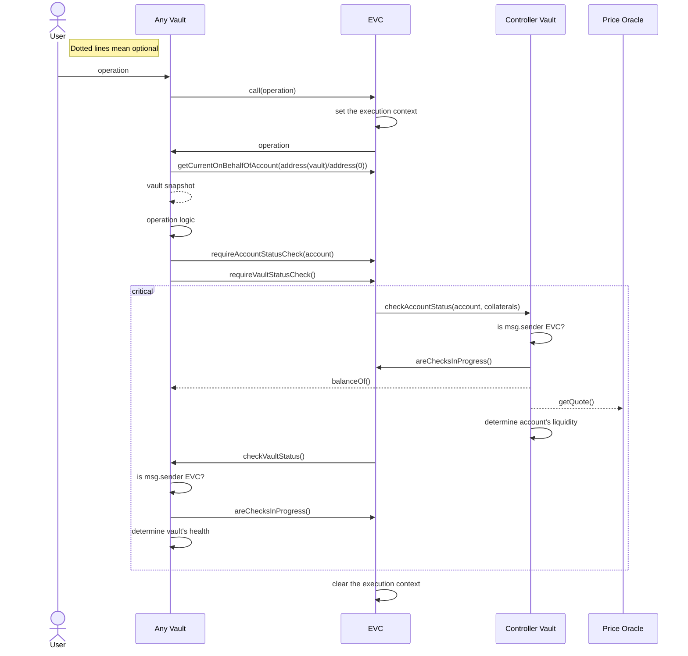

```mermaid
sequenceDiagram
    actor User
    Note right of User: Dotted lines mean optional
    participant Any Vault
    participant EVC
    participant Controller Vault
    participant Price Oracle

    User->>Any Vault: operation
    Any Vault->>EVC: call(operation)
    EVC->>EVC: set the execution context
    EVC->>Any Vault: operation
    Any Vault->>EVC: getCurrentOnBehalfOfAccount(address(vault)/address(0))
    Any Vault-->>Any Vault: vault snapshot
    Any Vault->>Any Vault: operation logic
    Any Vault->>EVC: requireAccountStatusCheck(account)
    Any Vault->>EVC: requireVaultStatusCheck()

    critical
        EVC->>Controller Vault: checkAccountStatus(account, collaterals)
        Controller Vault->>Controller Vault: is msg.sender EVC?
        Controller Vault->>EVC: areChecksInProgress()
        Controller Vault-->>Any Vault: balanceOf()
        Controller Vault-->>Price Oracle: getQuote()
        Controller Vault->>Controller Vault: determine account's liquidity

        EVC->>Any Vault: checkVaultStatus()
        Any Vault->>Any Vault: is msg.sender EVC?
        Any Vault->>EVC: areChecksInProgress()
        Any Vault->>Any Vault: determine vault's health
    end

    EVC->>EVC: clear the execution context
```