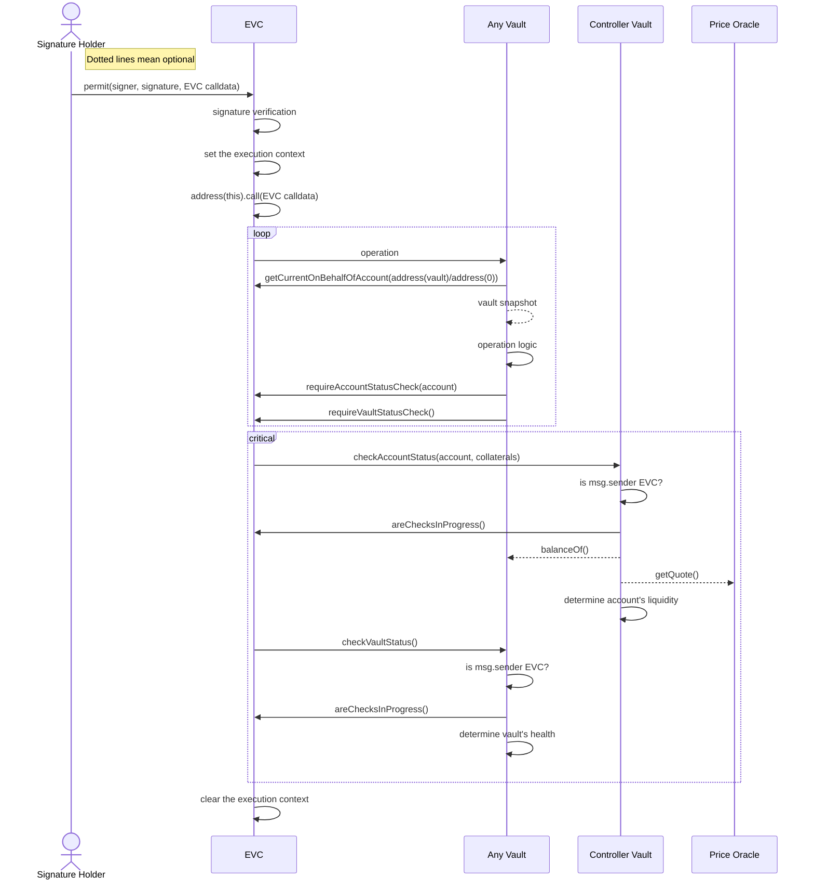

```mermaid
sequenceDiagram
    actor Signature Holder
    Note right of Signature Holder: Dotted lines mean optional
    participant EVC
    participant Any Vault
    participant Controller Vault
    participant Price Oracle

    Signature Holder->>EVC: permit(signer, signature, EVC calldata)
    EVC->>EVC: signature verification
    EVC->>EVC: set the execution context
    EVC->>EVC: address(this).call(EVC calldata)

    loop 
        EVC->>Any Vault: operation
        Any Vault->>EVC: getCurrentOnBehalfOfAccount(address(vault)/address(0))
        Any Vault-->>Any Vault: vault snapshot
        Any Vault->>Any Vault: operation logic
        Any Vault->>EVC: requireAccountStatusCheck(account)
        Any Vault->>EVC: requireVaultStatusCheck()
    end

    critical
        EVC->>Controller Vault: checkAccountStatus(account, collaterals)
        Controller Vault->>Controller Vault: is msg.sender EVC?
        Controller Vault->>EVC: areChecksInProgress()
        Controller Vault-->>Any Vault: balanceOf()
        Controller Vault-->>Price Oracle: getQuote()
        Controller Vault->>Controller Vault: determine account's liquidity

        EVC->>Any Vault: checkVaultStatus()
        Any Vault->>Any Vault: is msg.sender EVC?
        Any Vault->>EVC: areChecksInProgress()
        Any Vault->>Any Vault: determine vault's health
    end

    EVC->>EVC: clear the execution context
```