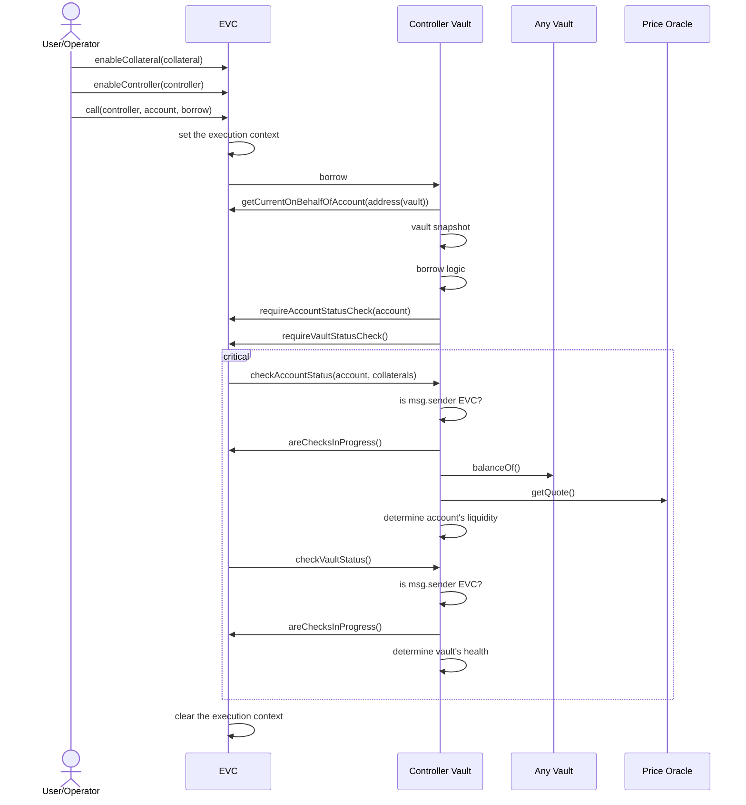

```mermaid
sequenceDiagram
    actor User/Operator
    participant EVC
    participant Controller Vault
    
    participant Any Vault
    participant Price Oracle

    User/Operator->>EVC: enableCollateral(collateral)
    User/Operator->>EVC: enableController(controller)
    User/Operator->>EVC: call(controller, account, borrow)
    EVC->>EVC: set the execution context
    EVC->>Controller Vault: borrow
    Controller Vault->>EVC: getCurrentOnBehalfOfAccount(address(vault))
    Controller Vault->>Controller Vault: vault snapshot
    Controller Vault->>Controller Vault: borrow logic
    Controller Vault->>EVC: requireAccountStatusCheck(account)
    Controller Vault->>EVC: requireVaultStatusCheck()

    critical
        EVC->>Controller Vault: checkAccountStatus(account, collaterals)
        Controller Vault->>Controller Vault: is msg.sender EVC?
        Controller Vault->>EVC: areChecksInProgress()
        Controller Vault->>Any Vault: balanceOf()
        Controller Vault->>Price Oracle: getQuote()
        Controller Vault->>Controller Vault: determine account's liquidity

        EVC->>Controller Vault: checkVaultStatus()
        Controller Vault->>Controller Vault: is msg.sender EVC?
        Controller Vault->>EVC: areChecksInProgress()
        Controller Vault->>Controller Vault: determine vault's health
    end

    EVC->>EVC: clear the execution context
```