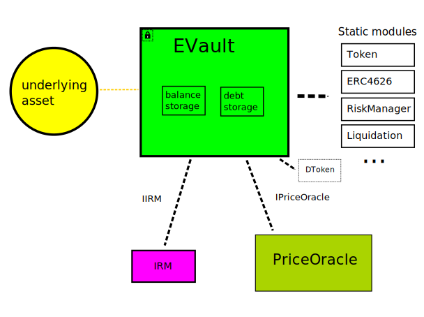
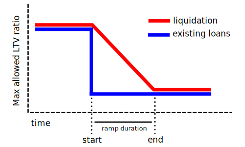
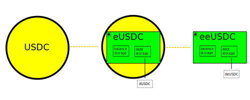

# Euler Vault Kit

Dariusz Glowinski, Mick de Graaf, Kasper Pawlowski, Anton Totomanov, Tanya Roze, Alberto Cuesta Cañada, Michael Bentley, Doug Hoyte

<!-- TOC FOLLOWS -->
<!-- START OF TOC -->
<!-- DO NOT EDIT! Auto-generated by md-toc: https://github.com/hoytech/md-toc -->

* [Introduction](#introduction)
* [Creation](#creation)
    * [Upgradeable vs Immutable](#upgradeable-vs-immutable)
    * [Governed vs Finalised](#governed-vs-finalised)
    * [Governance Risk](#governance-risk)
    * [Name and Symbol](#name-and-symbol)
* [Accounting](#accounting)
    * [Exchange Rate](#exchange-rate)
    * [Token Transfers](#token-transfers)
    * [Internal Balance Tracking](#internal-balance-tracking)
    * [Rounding](#rounding)
    * [DToken](#dtoken)
    * [Balance Forwarding](#balance-forwarding)
* [Interest](#interest)
    * [Compounding](#compounding)
    * [Interest Rate Models](#interest-rate-models)
    * [Fees](#fees)
    * [Fee Share](#fee-share)
    * [ProtocolConfig](#protocolconfig)
* [Risk Management](#risk-management)
    * [LTV](#ltv)
    * [Risk Adjustment](#risk-adjustment)
    * [Borrowing vs Liquidation LTV](#borrowing-vs-liquidation-ltv)
    * [Untrusted Collaterals](#untrusted-collaterals)
        * [Cleared versus 0 LTVs](#cleared-versus-0-ltvs)
        * [Non-collateral Deposits](#non-collateral-deposits)
    * [LTV Ramping](#ltv-ramping)
    * [Supply and Borrow Caps](#supply-and-borrow-caps)
    * [Hooks](#hooks)
        * [Hook Use-Cases](#hook-use-cases)
* [Price Oracles](#price-oracles)
    * [Pricing Shares](#pricing-shares)
    * [`IPriceOracle`](#ipriceoracle)
    * [Quotes](#quotes)
    * [Vault Configuration](#vault-configuration)
    * [Unit of Account](#unit-of-account)
* [Liquidation](#liquidation)
    * [Discount](#discount)
    * [Maximum Discount](#maximum-discount)
    * [Cool-Off Period](#cool-off-period)
    * [Bad Debt Socialisation](#bad-debt-socialisation)
    * [Alternative Liquidations](#alternative-liquidations)
* [Perspectives](#perspectives)
    * [Token Lists](#token-lists)
    * [Whitelist Perspective](#whitelist-perspective)
    * [Escrow Perspective](#escrow-perspective)
    * [Cluster Perspective](#cluster-perspective)
* [Composing Vaults](#composing-vaults)
    * [Collateral Interest](#collateral-interest)
    * [Custom Collaterals](#custom-collaterals)
    * [Nesting](#nesting)
    * [Bootstrapping](#bootstrapping)
* [Synthetic Asset Vaults](#synthetic-asset-vaults)
    * [`ESynth`](#esynth)
        * [Minting](#minting)
        * [Burning](#burning)
        * [Allocating to a Vault](#allocating-to-a-vault)
        * [Deallocating from a vault](#deallocating-from-a-vault)
        * [Total Supply adjustments](#total-supply-adjustments)
    * [`IRMSynth`](#irmsynth)
        * [Parameters](#parameters)
        * [Mechanism](#mechanism)
    * [`EulerSavingsRate`](#eulersavingsrate)
    * [`PegStabilityModule`](#pegstabilitymodule)
* [Interaction Patterns](#interaction-patterns)
    * [Swapping](#swapping)
    * [EVC Operators](#evc-operators)
    * [Gasless Transactions](#gasless-transactions)
* [Appendices](#appendices)
    * [ERC-4626 Incompatibilities](#erc-4626-incompatibilities)
    * [ERC-20 Incompatibilities](#erc-20-incompatibilities)
    * [Static Modules](#static-modules)
        * [Delegatecall into view functions](#delegatecall-into-view-functions)
        * [Gas vs Code-Size Tradeoff](#gas-vs-code-size-tradeoff)
        * [CallThroughEVC](#callthroughevc)
        * [Inheriting From EVault](#inheriting-from-evault)
    * [Quantity Typing](#quantity-typing)
    * [Overflows](#overflows)
        * [Amount Overflows](#amount-overflows)
        * [Interest Overflows](#interest-overflows)

<!-- END OF TOC -->

## Introduction

The Euler Vault Kit (EVK) is a system for constructing _credit vaults_. Credit vaults are [ERC-4626](https://eips.ethereum.org/EIPS/eip-4626) vaults with added borrowing functionality. Unlike typical ERC-4626 vaults which earn yield by actively investing deposited funds, credit vaults are passive lending pools.

Users can borrow from a credit vault as long as they have sufficient collateral deposited in other credit vaults. The liability vault (the one that was borrowed from) decides which credit vaults are acceptable as collateral. Interest is charged to borrowers by continuously increasing the amount of their outstanding liability and this interest results in yield for the depositors.

Vaults are integrated with the [Ethereum Vault Connector](https://github.com/euler-xyz/ethereum-vault-connector/) contract (EVC), which keeps track of the vaults used as collateral by each account. In the event a liquidation is necessary, the EVC allows a liability vault to withdraw collateral on a user's behalf.

The EVC is also an alternate entry-point for interacting with vaults. It provides multicall-like batching, simulations, gasless transactions, and flash liquidity for efficient refinancing of loans. External contracts can be invoked without needing special adaptors, and all functionality is accessible to both EOAs and contract wallets. Although each address is only allowed one outstanding liability at any given time, the EVC provides it with 256 virtual addresses, called sub-accounts (from here on, just accounts). Sub-account addresses are internal to the EVC and compatible vaults, and care should be taken to ensure that these addresses are not used by other contracts.

The EVC is responsible for _authentication_, and vaults are responsible for _authorisation_. For example, if a user attempts to redeem a certain amount, the EVC makes sure the request actually came from the user, and the vault makes sure the user actually has this amount.

## Creation

A vault consists of several communicating components:

- The _underlying asset_ is the ERC-20 token that will be held by the vault. Each vault holds exactly one underlying asset.
- `EVault` is the primary entry-point contract and implements the logic that is common to all vaults, such as tracking which addresses have deposited and which have outstanding borrows, validating the [health](#risk-adjustment) of positions, and permitting liquidations. For code organisation purposes, some of its logic is delegated to static (non-upgradeable) [modules](#static-modules).
- `PriceOracle` components interface with external [pricing systems](#price-oracles) to compute the values of collaterals and liabilities in real time.
- IRM (Interest Rate Model) components compute [interest rates](#interest) in order to incentivise more or less borrowing.
- `ProtocolConfig` is a global [protocol-level configuration](#protocolconfig) contract. This configuration has no direct influence on the vault except for controlling the destination address of [protocol fees](#fees), and the (bounded) portion of interest fees to be split between the protocol and vault governor.

Before creating a vault, `PriceOracle` and `IRM` contracts should be created (or re-used). These will be installed in the `EVault`. During creation, `EVault` creates a side-car [DToken](#dtoken) contract to expose a read-only ERC-20 interface for debt amounts.



### Upgradeable vs Immutable

`EVault` instances are created by a factory contract. This factory has an `implementation` address in its storage that points to the actual code-containing contract. Anyone can create proxies that reference this implementation contract, each of which is a vault. When creating a proxy, a boolean `upgradeable` flag is specified:

- If `upgradeable` is true, the factory will create a [beacon proxy](https://docs.openzeppelin.com/contracts/4.x/api/proxy), with the factory itself set as the beacon contract.
- If `upgradeable` is false, the factory will create a minimal proxy contract inspired by [EIP-3448 MetaProxy](https://eips.ethereum.org/EIPS/eip-3448), with the current value of `implementation` as the target contract.

The factory has an `upgradeAdmin` address that can change the value of `implementation`, but this will only affect vaults that were created as `upgradeable`. This allows vault creators to choose whether they want the factory admin to be able to upgrade their vaults, or if instead they should be immutable. In order to prevent the implementation from being changed after validating but before vault creation, a `desiredImplementation` parameter can be specified. Alternatively, the vault's implementation can be confirmed to be the desired version after creation.

Verifying that a vault was created by a trusted factory verifies that the vault's code too can be trusted. Users should perform due diligence on vaults created by unknown factories because they could be malicious. User interfaces may choose to only display vaults created by certain factories.

### Governed vs Finalised

Immediately after creation, the factory will call `initialize()` on the proxy, passing in the creator's address as a parameter. The vault will set its _governor_ to the creator's address. This governor can invoke methods that modify the configuration of the vault.

At this point, the creator should configure the vault as desired and then decide if the vault is to be governed or not.

- If so, the creator retains the governor role or transfers it to another address.
- If not, then the ownership is revoked by setting the governor to `address(0)`. No more governance changes can happen on this vault and it is considered finalised.

If limited governance is desired, the creator can transfer ownership to a smart contract that can only invoke a sub-set of governance methods, perhaps with only certain parameters, or under certain conditions.

Using governance methods for vault configuration even for vaults that ultimately will be finalised simplifies the initialisation interface, and is inspired by unix's [fork-exec separation](https://stackoverflow.com/questions/5090731/why-fork-and-exec-are-kept-2-seperate-calls/5117197#5117197).

The vault uses EVC authentication for the governor, which means that governor actions can be batched together and simulated. However, the vault does not accept advanced EVC authentication methods like operators, sub-accounts, and `controlCollateral`.

Using the same code-base and factories, the Euler Vault Kit allows construction of both managed and unmanaged lending products. Managed vaults are intended to be long-lived and are therefore suitable for passive deposits. If market conditions change, an active governor can reconfigure the vault to optimise or protect users. Alternatively, unmanaged vaults are configured statically, and the users themselves (or a higher-level contract) must actively monitor for risks/opportunities and shift their deposits and positions to new vaults as necessary.

### Governance Risk

Upgradeable/Immutable and Governed/Finalised are orthogonal properties of a vault, and can be set in any combination. The Euler Vault Kit is an agnostic vault-construction system. It is up to the vault creator to decide the parameters and the governance structure (if any), and ultimately up to the market to decide which vaults should be rewarded with liquidity.

The following table indicates the governance risk profile that results from the vault creator's decisions:

<table>
  <tr>
    <td></td>
    <th>Upgradeable</th>
    <th>Immutable</th>
  </tr>
  <tr>
    <th>Governed</th>
    <td>Factory Admin + Governor</td>
    <td>Governor</td>
  </tr>
  <tr>
    <th>Finalised</th>
    <td>Factory Admin</td>
    <td>None</td>
  </tr>
</table>

Note that there are also risks to creating immutable/finalised vaults:

- If market conditions change such that a formerly safe collateral asset or price oracle becomes unsafe, only governed vaults can be reconfigured.
- If critical bugs are found in the Vault Kit code, the factory admin will only be able to fix upgradeable vaults.

In the event of discovered bugs, a difficult situation can arise for the factory admin. By fixing the bug for upgradeable vaults, sufficient information to exploit the non-upgradeable vaults may be revealed. Factory admins should specify a clear security upgrade policy, and responsibly evaluate the impact of upgrades on a case-by-case basis.

### Name and Symbol

Vaults have fixed names and symbols that are determined at creation time. The symbol has three components: An `e` prefix, the underlying's symbol, and a numeric ID. Here is a possible example for a `USDC` vault:

* Symbol: `eUSDC-1`
* Name: `EVK Vault eUSDC-1`

The numeric ID is allocated using a simple `SequenceRegistry` contract which maintains sequentially-increasing counters for opaque string designators. Vaults use the underlying symbols as designators but anybody can reserve new IDs for any designators at any time. The only guarantee is that no two reservations for the same designator will return the same ID.

If the underlying asset does not implement the `symbol()` method, the symbol will be replaced with `"UNDEFINED"`.

Standard security properties with names and symbols continue to hold. There is nothing stopping anybody else from deploying an unrelated vault that also has the symbol `eUSDC-1`, so symbols cannot be assumed to be globally unique.


## Accounting

`EVault` contracts are ([mostly](#erc-4626-incompatibilities)) standard-conforming ERC-4626 vaults with additional functionality to implement borrowing. Each vault instance holds only one type of token: the vault's underlying asset (simply called `asset` in the code). Because ERC-4626 is a superset of ERC-20, vaults are also tokens, called vault shares or ETokens. These shares represent a proportional claim on the vault's assets, and are exchangeable for larger amounts of the underlying asset over time as interest is accrued. As recommended by ERC-4626, shares have the same number of decimals as their underlying asset's token. If the underlying asset does not specify decimals, the vault assumes `18`.

### Exchange Rate

A vault has two categories of assets that shares have a claim to:

- `cash`: Underlying tokens currently held by the vault (in underlying assets)
- `totalBorrows`: Outstanding borrows, including accrued interest (in underlying assets)

The exchange rate represents how much of the underlying asset each vault share is worth. As interest accrues over time, the exchange rate will grow. Conceptually, the exchange rate can be computed by dividing the vault's total assets (`cash + totalBorrows`) by the number of outstanding shares, which is tracked as `totalShares`.

The vault contract avoids directly computing the exchange rate as a ratio in order to prevent precision loss from affecting tokens with a small number of decimals. For this reason, external users who also wish to convert between assets and shares are advised to use the `convertToAssets` and `convertToShares` functions from the ERC-4626 standard.

When a vault is first created, it has 0 outstanding shares, meaning that the simple description of the exchange rate above would be undefined (dividing by 0). Furthermore, when there are a very small number of shares and underlying assets, the effects of rounding are more pronounced. For these reasons, vaults apply a "virtual deposit" to the exchange rate calculation. The virtual deposit can be considered a deposit at a 1:1 exchange rate, followed by burning the received shares (see [OpenZeppelin's article](https://blog.openzeppelin.com/a-novel-defense-against-erc4626-inflation-attacks) for more details).

Incorporating the virtual deposit, the full exchange rate equation is the following:

```solidity
exchangeRate = (cash + totalBorrows + VIRTUAL_DEPOSIT)
                  / (totalShares + VIRTUAL_DEPOSIT)
```

`totalBorrows` does not necessarily correspond to the sum of all the individual debts because each account has its debt rounded up, whereas `totalBorrows` is rounded up only once.

Since the virtual deposit shares are incorporated into the exchange rate, they will increase in value as interest is accrued, as any other shares do. This interest will remain permanently locked in the vault. Although in most circumstances this locked interest will be negligible, it may be problematic for tokens with high unit value and/or low decimals (WBTC, GUSD). In order to create vaults for such tokens which are expected to contain small deposits, an 18-decimal wrapper contract can be used around the token.

### Token Transfers

In order to move tokens in or out of the vault, the vault code has internal abstractions `pullAssets` and `pushAssets`.

`pullAssets` will first attempt to call `transferFrom` on the underlying asset using the vault's address as the recipient. If the user has given sufficient approval for the vault, this will succeed. Otherwise, `pullAssets` will attempt to use [Permit2](https://github.com/Uniswap/permit2) to transfer the assets into the vault. Permit2 can enable better user experiences because approvals can be created as signed messages that are bundled into the same EVC batch as a `deposit` (for example). Although the user does need to first add an approval for the Permit2 contract, this is a one-time operation and many users will already have done this when interacting with Uniswap or other apps.

`pushAssets` always simply uses `transfer` on the underlying asset. However, in order to prevent loss of funds, `pushAssets` will first check with the EVC to see if the recipient address is a known non-owner address (a virtual sub-account address). If so, it will refuse to transfer the assets. If the underlying asset is EVC-aware (perhaps a [nested vault](#nesting)), then the `CFG_EVC_COMPATIBLE_ASSET` config flag can be enabled, which prevents this check.

In the event that these abstractions are bypassed and underlying asset tokens are directly transferred to a vault, these tokens can be recovered with the vault's `skim()` function. The first user who calls `skim()` will claim them by performing an implicit deposit. In certain situations, this can be useful as a more gas-efficient deposit method, however care must be taken that nobody else skims the tokens in between.

### Internal Balance Tracking

In order to retrieve the quantity of the underlying asset it currently possesses (`cash`), a vault-like contract has two options:

- Read its own balance from the underlying asset by calling `underlying.balanceOf(address(this))`
- Keep an internal copy of the expected value in storage, and update it whenever tokens are transferred in or out

The Euler Vault Kit uses the second method, called _internal balance tracking_. Tracking the balance internally prevents users from manipulating the exchange rate by directly transferring underlying assets to the vault, which could be dangerous when attempting to [price the vault's shares](#pricing-shares). Internal balance tacking also uses slightly less gas for many common operations.

On the other hand, tokens that change balances outside of explicit transfers, such as rebasing/fee-on-transfer tokens, are not supported because the vault is not aware of the unexpected balance changes. This is not viewed as a significant problem since lending such tokens has several [well known problems](https://medium.com/eulerfinance/steth-and-the-hazards-of-rebasing-tokens-855ddfaa9a1b), and regularised wrapper contracts can always be built around them.

### Rounding

Internally, debts are tracked with extra precision relative to the liability token's decimals. Externally, debt amounts are always rounded up to the next smallest increment expressible in the liability token. This ensures that borrowers always repay at least what they borrowed and plus any accrued interest.

The quantity of assets that can be redeemed for a given number of shares is always rounded down, and the number of shares required to withdraw a given quantity of assets is rounded up. This ensures that depositors cannot withdraw more than they deposited plus earned interest.

These two behaviours ensure that all impact of rounding happens in favour of the vault (ie, the remaining depositors). However, because the rounding represents an [implicit donation](https://www.euler.finance/blog/exchange-rate-manipulation-in-erc4626-vaults) to the vault, this means that it can affect the exchange rate. This is one of the reasons for the virtual deposit: even with an empty vault, the effect of rounding on the exchange rate is insignificant.

In the degenerate case of a quantity rounding to exactly `0`, the operation is treated as a no-op (nothing happens).

### DToken

Although debts are tracked in the vault storage along with balances and can be read with `debtOf()`, vaults also provide `DToken` as a read-only ERC-20 interface to the debts. Whenever a debt amount changes, the vault calls into the `DToken` contract to trigger a `Transfer` log. Note that the `DToken` logs are the net of the change in debt (accrued interest plus/minus the borrow/repay amount).

The main purpose of `DToken` is for off-chain analysis: Debt modifications are shown clearly in block explorers, and borrow/repay events can be tracked by tax-accounting software. Because the contract does not support transfers or approvals, advanced users who want debt portability should use the `pullDebt()` function on the vault contract. This allows anyone to voluntarily assume anyone else's debt, providing the controller vault permits it (usually as long as the puller has enabled the controller and has sufficient collateral).

The `DToken` contract is the first (and only) contract created by `EVault`, so its address can be [calculated](https://eips.ethereum.org/EIPS/eip-161#specification) from the vault's address and the nonce `1`. This method may not work on all EVM chains.

### Balance Forwarding

Extra incentives beyond pure interest can be important drivers for liquidity. These reward incentives can be built into the vault contracts themselves (ie Compound) or allocated entirely off-chain (ie Euler V1). Incorporating reward logic directly into the vault contract itself allows instant and trustless distribution, but could increase gas costs for everyone (even if their rewards are insignificant) and, more importantly, might require deciding on a static rewards issuance policy at vault deployment time.

_Balance forwarding_ is an attempt to get the best of both worlds. If an account opts in, every time its balance changes an external contract will be notified of the updated balance. This external contract has no special privileges in the vault, however it should take care to ensure that its `balanceTrackerHook` method does not revert or use up all gas, since this could cause critical vault operations to fail.

A general-purpose system called [Reward Streams](https://github.com/euler-xyz/reward-streams) is the recommended implementation for the balance forwarding contract. It allows anyone to permissionlessly incentivise any vault with any token at any time.

## Interest

### Compounding

Interest is accumulated on the first transaction in a block: Actual time must elapse for any interest to be accrued. However, a new interest rate is targetted whenever balance or debt amounts change. This is done in the `checkVaultStatus` function so that batches that interact with a vault multiple times only need to re-target the interest rate once.

Vaults compound interest deterministically every second using exponentation. Because accrued interest is added to `totalBorrows`, it increases utilisation (the proportion of the vault's assets that are loaned out). Other than this (and the effect of accumulator rounding), the amount of interest owed/earned is independent of how frequently the contract is interacted with.

### Interest Rate Models

Interest Rate Models (IRMs) are contracts which determine the interest rate that should be charged given the state of a vault. Typically they are pure functions based on the utilisation, but this is not required. Today the most common function is a "linear-kink" model, which starts off with a gradual slope and then suddenly becomes steep at a particular target utilisation value. The `computeInterestRate` function of the `IIRM` interface accepts the bare minimum necessary to compute utilisation.

Vaults invoke their IRMs during the vault status check. This means that if a vault is interacted with multiple times in an EVC batch, the IRM only needs to be called once, at the end of the batch. Vaults cache this interest rate in their storage so that on the first operation of a subsequent block the interest can be accrued. The interest rate must be pre-computed and cached so that non-pure IRMs will not be able to retroactively change observed interest accurals. Non-pure IRMs can be invoked to re-target the interest rate at any time with the `touch` method (depositors should touch when it would re-target upwards, borrowers otherwise).

IRMs can query the vault for additional information without triggering read-only re-entrancy protection because this lock is released at the time of the vault status check. Examples where this might be useful are with [nested vaults](#nesting) which may partially derive their interest rates from their parent vaults' state, or with vaults that implement synthetic assets.

IRMs return the interest rate that _borrowers_ must pay. Depositors (aka suppliers) will typically receive a lesser rate than this because the received interest is proportionally split up amongst all the depositors and the `interestFee`.

The IRM interface specifies interest rates in terms of "second percent yield" (SPY) values which are per-second compounded interest rates scaled by `1e27`. Although not used by the contracts themselves, for consistency we recommend that conversion of SPY to annualised equivalents (in UIs and elsewhere) should use the number of seconds in the average Gregorian calendar year of 365.2425 days.

When a vault has `address(0)` installed as an IRM, an interest rate of `0%` is assumed. If a call to the vault's IRM fails, the vault will ignore this failure and continue with the previous interest rate. An operation that runs out of gas in the IRM call but otherwise has enough gas to successfully complete could delay updating the interest rate, but this will be corrected on the next interaction with the vault.

Although most IRMs implement pure functions, when re-targeting the interest rate, vaults do not invoke them with `staticcall` in order to support stateful or reactive IRMs. The `computeInterestRate()` method should verify that `msg.sender == vault`. IRMs also must implement a corresponding `computeInterestRateView()` method which does not update state. Even though vaults store the current interest rate in their storage, `computeInterestRateView()` is useful for obtaining updated interest rates mid-batch (especially during a simulation) since the stored rate may be stale.

### Fees

Whenever interest is accrued, a portion of the interest is allocated to _fees_. This is analogous to the concept of reserves in other protocols. The fraction of interest that is allocated to fees is controlled by the governor as the parameter `interestFee`, although this is validated by the [ProtocolConfig](#protocolconfig)'s `isValidInterestFee()` method.

Whenever interest is accrued, each borrower's liability increases accordingly. The interest fees are charged by creating the amount of shares necessary to dilute depositors by the `interestFee` fraction of the interest (see the [Euler V1 whitepaper](https://github.com/euler-xyz/euler-docs/blob/master/developers/getting-started/architecture.md#derivation-of-reserves-formulas) for the derivation). Since fees are denominated in vault shares, not the underlying asset, unwithdrawn fees themselves earn compound interest over time.

Currently when calculating the amount of shares to create for fees, the new exchange rate is used and the [virtual deposit](#exchange-rate) is ignored. This has the effect of fees typically being slightly lower than they otherwise would be, although it should be negligible in practice.

### Fee Share

For efficiency, accrued interest fees are internally tracked in a special virtual account inside the vault. In order to convert these into regular shares that can be redeemed for the underlying asset, the `convertFees` method can be invoked on the vault. Anyone can invoke this method at any time.

`convertFees` computes the amount of new shares that have accrued since the previous call, and then calls the [ProtocolConfig](#protocolconfig)'s `protocolFeeConfig()` method. This returns the fee share, which is the portion of the interest fees due to the Euler DAO and its receiver address. The vault validates the fee share and then transfers this proportion of accrued interest to the indicated address. The remaining is transferred to the `feeReceiver` address specified by the vault's governor. If no `feeReceiver` was specified, then this portion is also transferred to the Euler DAO's receiver.

Note that because the `ProtocolConfig` can change the fee share at any time, the portion of the accrued interest sent to the Euler DAO is not finalised until `convertFees` is invoked. If a vault governor is concern about this, `convertFees` should be invoked frequently.

### ProtocolConfig

The `ProtocolConfig` contract is the representative of the Euler DAO's interests in the vault kit ecosystem. What vaults allow this contract to control is strictly limited. For non-upgradeable vaults these limits are enforced permanently.

While parameters such as `interestFee` negotiate the relationship between depositors and the vault governor, `ProtocolConfig` negotiates between the vault governor and the Euler DAO.

`ProtocolConfig` exposes the following methods that are called by the vaults:

- `isValidInterestFee()`: Determines whether the value of an [interest fee](#fees) is allowed. Vaults only invoke this if the governor attempts to set an interest fee outside of the range 10% to 100% (the guaranteed range).
- `feeConfig()`: This method is called when fees are converted. It returns the following:
  - `feeReceiver`: The recipient address for the DAO's share of the fees.
  - `protocolFeeShare`: The fraction of the interest fees that should be sent to the DAO. If the `ProtocolConfig` sends back a value greater than 50%, then vaults will ignore this value and use 50% instead.

## Risk Management

In order for it to detect impermissible user actions, the EVC requires that vaults implement the following two methods:

- `checkAccountStatus`: Is the specified account in violation? If an account has any liabilities, is the value of its collateral sufficient?
- `checkVaultStatus`: Is the vault itself healthy? Have vault-level limits like borrow and supply caps been exceeded?

These methods are invoked by the EVC at [appropriate times](https://evc.wtf/docs/whitepaper#account-status-checks). Often this will be after all operations in a batch have been performed, because the EVC allows users to defer these checks as a type of flash liquidity. If a vault would like to indicate that a status check has failed, it reverts, aborting the transaction and all performed operations.

### LTV

In order for borrowing to occur, the governor of the liability vault must decide on a set of collateral assets and their maximum allowed Loan To Value ratios (from here on just called LTVs). LTVs should be chosen carefully. In addition to the risk inherent in the underlying asset, the vault that contains the asset should also be considered. If the collateral itself can be loaned out against risky collateral or uses unsafe pricing oracles, lower LTVs may be appropriate.

In order to add a collateral and configure its LTVs, the governor calls the `setLTV()` method. The specified LTVs are fractions between 0 and 1 (scaled by 10,000), and correspond to the risk adjustment that is applied to collateral value when determining whether an account is in violation of its LTV. While the EVC ensures that each account has at most one liability, a loan can be backed by multiple collaterals.

### Risk Adjustment

In order to ensure excess collateral is available to pay a [liquidation discount](#discount) if necessary, each account's collateral value must be larger than its liability by some safety buffer. The process of _risk-adjustment_ is used to determine the size of this safety buffer.

To compute the risk-adjusted collateral value, the vault converts all collateral balances to a [common currency](#unit-of-account), multiplies each by their corresponding LTV, and then sums them. Because LTVs are always less than 1, risk-adjustment always decreases the collateral value.

In order for an account to be _healthy_, the risk-adjusted value of its collateral assets must be strictly greater than the value of its liability, or the liability amount itself must be exactly zero. When an account is not healthy, it is said to be in _violation_.

When determining if an account is healthy, a liability vault will iterate over the account's collaterals and keep a running sum of the risk-adjusted value. If this sum ever exceeds the liability's value, then it will stop the iteration: the account is already known to be healthy. This can save substantial gas if expensive pricing oracles are used. Users can optimise the order of their collateral entries with the EVC's `reorderCollaterals` function. This implementation was inspired by Gearbox. If the governor has not set an LTV for a collateral (or it is 0), then this will not contribute anything to the account's risk-adjusted collateral value and the vault will not waste gas trying to price it.

### Borrowing vs Liquidation LTV

`setLTV()` accepts separate borrowing and liquidation LTV values. The borrowing LTV must be less than or equal to the liquidation LTV. The risk-adjustment process is identical for both types of LTV. The context determines which one is used:

* The borrowing LTV is used within the account status check, which has the effect of limiting the size of *new* borrows. If an account is in violation here, it means it cannot perform any operations except those that can improve its health (deposit and repay), unless those operations solve the violation.
* The liquidation LTV is used when an attempt is made to [liquidate](#liquidation) the account. Only accounts that are in violation are allowed to be liquidated. This means that the liquidation LTV has the effect of limiting *existing* borrows.

The primary purpose for having two LTVs is to compensate for pricing delays and uncertainty. Suppose an attacker knows that a very large price movement is about to happen, either because the price feed is delayed or because they are manipulating the oracle. The attacker can deposit some collateral, borrow as much as possible, and then wait for the price to update. If the price update is sufficient to push the account beyond the LTV safety buffer, then the account's liability will be [bad debt](#bad-debt-socialisation) (liability value exceeds collateral value). The attacker could then liquidate themselves to recover all the collateral, leaving the vault's depositors with a loss. Below we describe [another variation](#cool-off-period) of this attack.

Adding a gap between the borrowing LTV and the liquidation LTV creates an additional hurdle to exploitation by requiring attackers to find or cause proportionally larger price movements. Although it can be a useful risk management tool, it does not solve the fundamental issue and comes with tradeoffs: Conceptually, when adding a gap to a vault, either the liquidation LTV can be raised, increasing risk to the vault by delaying liquidations, or the borrowing LTV can be lowered, decreasing the leverage available to borrowers and making the vault less attractive.

Another way to effectively add a gap is by using [price oracles](#price-oracles) with a non-zero bid-ask spread. This allows the components with the most context on a pricing source's accuracy to communicate real-time pricing risks to the vault, which can then apply this information as a [dynamic borrowing LTV](https://github.com/euler-xyz/euler-price-oracle/blob/master/docs/whitepaper.md#lending-application).


### Untrusted Collaterals

Selecting appropriate vaults as allowed collateral is critical for the security of a vault. All vaults must be EVC-compatible, and must use the same EVC deployment. The vault must also be priceable by the configured [price oracle](#price-oracles).

Using vaults with illiquid or manipulable underlying assets could threaten the safety of depositors. And vaults that have dangerous configurations -- like extremely high LTVs or themselves have poorly chosen collaterals -- might encounter bad debt situations.

It is also critical to evaluate the smart contract code that implements each collateral vault. A badly coded or malicious vault could refuse to release funds in a liquidation event, or simply lie about the value of its holdings. For this reason it is recommended to only use vaults created by a known-good factory. A vault can be verified to have been created by a factory by calling the factory's `isProxy()` function.

When evaluating whether a new or customised vault implementation is trustworthy, all the usual checks should be performed, such as verifying the code was audited, does not contain backdoors, etc. In addition, it is very important to verify that the `transfer` method does not invoke any external contracts that could run attacker code. This is because the EVK implementation [forgives](https://evc.wtf/docs/whitepaper#forgiveness) the account status check of an account after liquidation, and a malicious user could perform actions that get unexpectedly forgiven.

For this reason, an important property of liquidation is that assets without an LTV can never be seized by liquidation (users can install any vaults in their EVC collateral set, trusted or not).

#### Cleared versus 0 LTVs

By default, all prospective collaterals are considered to have unset, or _cleared_ LTVs. Only by calling `setLTV()` do they become available as collateral. If a governor decides that a vault is no longer suitable as collateral, it can either have its liquidation LTV (and necessarily its borrowing LTV) set to 0, or it can be cleared with the `clearLTV()` function.

There is a subtle but important difference between the two: Former collaterals with a 0 LTV are still eligible to be seized in a liquidation, but cleared ones are not, for the reason described in [Untrusted Collaterals](#untrusted-collaterals).

So, if a vault can no longer be collateral for economic/market reasons, its LTV should be set to 0 (either with a ramp or in drastic cases without). On the other hand, if the vault's code is discovered to be buggy or malicious, its LTV should be cleared immediately.

#### Non-collateral Deposits

Although only vaults that were explicitly configured with an LTV can be used as collateral to support debt, when an account is not healthy the account's functionality will become limited. This includes failing withdrawals of non-collateral assets. Each account is considered a single position and when the position is unhealthy, the controller vault is considered within its rights to incentivize the user to repay their debt by any means. To fully segregate assets, use different sub-accounts to store deposits even when they aren't used as collateral.

### LTV Ramping

The LTV for one or more collateral assets can be modified by the governor. If the LTV is suddenly reduced, any oustanding borrowers might instantly be put into violation. Because of the [reverse dutch auction liquidation](#liquidation) system, these borrowers might unfairly lose a significant amount of value due to this action.

One solution to this might be to keep the liquidation LTV high for existing borrows, but reduce it for new borrows. This would be more fair, but has the undesirable effect of keeping these high-LTV borrows on the vault's books for an indefinite amount of time.

Instead governors can specify a _ramp duration_ when changing the liquidation LTV. Ramps only affect liquidation LTVs -- new borrows will immediately be required to use the new value. Ramps cause the liquidation LTV to linearly decrease to the new value over the specified duration. At some point in this window, affected positions will become unhealthy, but only slightly so. At this point, or soon after, the positions will be liquidated at a [minimal loss](#discount) to the borrower.



If a ramp is initiated while another ramp is already in progress, the current location on the previous ramp becomes the start of the new ramp, so as to prevent a sudden jump (only the slope is affected).

Even finalised vaults could benefit from LTV Ramping by installing a limited governor contract that can initiate a graceful wind-down under certain conditions.

### Supply and Borrow Caps

The governor may configure a supply cap, a borrow cap, or both. The supply cap is a limit on the amount of underlying assets that can be deposited into the vault, and the borrow cap is a limit on the amount that can be borrowed. Both are denominated in the underlying asset, but are packed into 2-byte decimal floating point values.

Caps can be transiently violated since they are only enforced at the end of a batch. If a cap was not in violation at the start of a batch but is at the end, then the transaction will be reverted.

Even though it can't be the direct result of a user action, in some cases caps can become persistently violated. For example if the governor reduces a cap or if accrued interest causes total borrows to exceed the borrow cap. If for one of these reasons a cap was in violation at the start of a batch, then the transaction will only succeed if the cap violation has lessened (or at least not gotten worse).

Note that this behaviour can in principle be exploited by opportunistically wrapping [gasless transactions](#gasless-transactions) that withdraw/repay into a surrounding batch that deposits/borrows an equivalent amount. The executor is effectively able to transfer the user's supply/borrow quota into their own account instead of reducing the capped value.

### Hooks

Vaults support a limited hooking functionality. In order to make use of this, the governor should install a hook config, which consists of two parameters:

* The hook target: the address of a contract, or `address(0)`
* The hooked ops: a bitfield that specifies the operations to be affected by hooks

Most user-invokable external functions are allocated constants. For example, the deposit function has `OP_DEPOSIT`. The hooked ops bitfield is the bitwise OR of these constants.

When a function is invoked, the vault checks if the corresponding operation is set in hooked ops. If so, the hook target is `call`ed using the same `msg.data` that was provided to the vault, along with the EVC-authenticated caller appended as trailing calldata. If the call to the hook target fails, then the vault operation will fail too. If the hook target is `address(0)` (or any non-contract address), then the operation fails unconditionally.

In addition to user-invokable functions, hooks can also hook `checkVaultStatus`. This will be invoked when the EVC calls `checkVaultStatus` on the vault, which is typically at the end of any batch that has interacted with the vault. This hook can be used to reject operations that violate "post-condition" properties of the vault.

The installed hook target contract address can bypass the vault's read-only reentrancy protection. This means that hook functions can call view methods on the vault. However, hooks cannot perform state changing operations because of the normal reentrancy lock.

Some hook configurations may cause the vault to not be entirely [ERC-4626 compliant](#erc-4626-incompatibilities);

#### Hook Use-Cases

The main purpose of the hook system is to disable vault functionality, either permanently or under certain conditions. The vault governor cannot use hooks to break core accounting invariants in the vault.

* Pause Guardian: The governor may be set as a contract that functions as a *pause guardian*. This contract could allow certain trusted users to pause and unpause individual vault operations, including deposit, withdraw, borrow, repay, transfer, and liquidate. This could potentially allow a safe wind-down of a distressed vault, hack prevention, or the safe recovery of funds after a hack. If the vault governor wants to ensure that some combinations of pause operations are disallowed (such as preventing liquidations when repay is disabled) then the pause guardian contract should enforce this.
* Synthetic Asset Vaults: These are [specialised vaults](#synthetic-asset-vaults) that require some restrictions provided by hooks. In particular, only the underlying asset itself is allowed to deposit into them, and certain other operations are disabled outright.
* Permissioned/RWA Vaults: Certain vault creators may wish to restrict who can deposit and/or borrow from the vault, either for compliance reasons or because the borrowing is under-collateralised.
* Flash loan fees: Normally the `flashLoan` function takes no fee. However, a hook can enforce a certain percentage of the flash loan is paid as a fee prior to allowing the loan to proceed.
* Utilisation caps: A hook could prevent a vault's utilisation from exceeding a particular level by reverting in `checkVaultStatus`. Note that depending on the exact requirements, a hook target may need to implement "snapshots", where the initial state of the vault is recorded in (potentially transient) storage upon operation initiation, and then read and cleared in `checkVaultStatus`.
* Minimum debt sizes: In order to prevent users from creating dust positions that are too small to profitably liquidate, a hook could be installed for every operation that changes debt. These hooks would record the accounts in a transient `Set`, and then verify that `debtOf()` for each is above a threshold in the `checkVaultStatus` hook.
* Restrict number of collaterals: The EVC limits the number of collateral assets an account can have enabled at any given time to `10`. This is important in order to maintain a reasonable upper-bound on the cost of liquidations. However, perhaps because they have configured especially expensive oracles, vaults may choose to limit this to a smaller number,


## Price Oracles

### Pricing Shares

Inside a vault, each collateral is configured as the address of another vault, not the underlying asset (unless the asset is specially constructed to also function as a collateral vault). This means that the value of a user's collateral is in fact the value of the vault's shares. A vault share is not necessarily equal to a unit of the underlying asset because of the [exchange rate](#exchange-rate).

Because converting quantities of shares to underlying asset amounts is itself a pricing operation, this responsibility is delegated to the price oracle.

For vaults created with the Euler Vault Kit, the ERC-4626 `convertToAssets` function can be used to price shares in units of the underlying asset. This function is designed to be a reliable oracle. [Internal balance tracking](#internal-balance-tracking) prevents manipulation with direct transfer donations, and the [virtual deposit](#exchange-rate) minimises the impact of rounding-based "stealth deposits". See our [article](https://www.euler.finance/blog/exchange-rate-manipulation-in-erc4626-vaults) for more details on these protections.

In some cross-chain designs, the price oracle is also responsible for determining the exchange rate of a corresponding vault on a separate chain.

### `IPriceOracle`

Each vault has the address of a price oracle installed. This address is immutable and cannot be changed, even by the vault governor. If updates to pricing sources are desired, this address should be a governed `EulerRouter` pricing component. All oracles must implement the [IPriceOracle](https://github.com/euler-xyz/euler-price-oracle/blob/master/docs/whitepaper.md#ipriceoracle) interface, specifically the following two functions:

```solidity
/// @notice One-sided price: How much quote token you would get for inAmount of base token, assuming no price spread
function getQuote(uint inAmount, address base, address quote) external view returns (uint outAmount);
```

```solidity
/// @notice Two-sided price: How much quote token you would get/spend for selling/buying inAmount of base token
function getQuotes(uint inAmount, address base, address quote) external view returns (uint bidOutAmount, uint askOutAmount);
```

These methods do not expose any pricing-level configuration. Instead, for custom pricing configurations, a new oracle contract must be deployed.

### Quotes

Price fractions are never directly returned by the interface. Instead, the oracle acts as though it is quoting swap amounts. This avoids certain catastrophic losses of precisions, especially with low-decimal tokens (see [an example with SHIB/USDC](https://github.com/euler-xyz/euler-price-oracle/blob/master/docs/whitepaper.md#precision-loss-example)).

Price oracles may legitimately return `0` to indicate that a requested quote amount is worthless, either because the price is very low or the quote amount was very small, or both. Legitimate pricing errors are signalled by a the oracle reverting. This in turn causes the vault to revert, which is dangerous since it can break functionality of the vault (most importantly, liquidation). Because of this, only reliable pricing oracles should be used.

The `getQuote` function returns how many `quote` tokens an `inAmount` of `base` tokens would purchase at the current marginal (no price impact) price. The `getQuotes` method (plural) may return both the bid and ask `quote` amounts for the specified quantity of `base`. Although simple oracles will return the same amounts for both bid and ask, more advanced vaults may use this to expose current market spreads. Alternatively, confidence intervals can be expressed, potentially by querying multiple oracles, sorting them, and returning the lowest amount as the bid and the highest as the ask.

Vaults use the difference between bid and ask amounts as a proxy for market depth or uncertainty. When verifying if a new loan is acceptable, the LTV is computed using bids for collaterals and the ask for the liability. This can be considered a dynamic adjustment to the borrowing LTV relative to the width of the bid-ask spread. On the other hand, when liquidating an existing loan, the `getQuote` mid-point price is used so that loans aren't liquidated by temporarily-wide price spreads. The vault assumes that the price oracle respects the following invariant: `bid <= mid-point <= ask`.

Because the interface accepts both `base` and `quote` addresses, oracles may be configured to compute _cross_ prices which combine several pricing sources. This is similar in concept to how swaps are sometimes routed through a sequence of DEX pools. At the very least, oracles should be able to cross price the shares to assets exchange rate with the underlying asset's price.

### Vault Configuration

Although each vault has an oracle address specified at creation time, the oracle does not need to use a homogenous source for all its pricing. For example, a vault with an underlying asset of USDC that allows DAI, USDT, WETH, and UNI vaults to be used as collateral may choose to use a 1:1 peg for its DAI/USDC price, Chainlink for USDT/USDC, Uniswap3 TWAP for WETH/USDC, and to forward its pricing for UNI to another `IPriceOracle` implementation. Because of shares pricing, even two vaults with the same underlying asset could use different oracles.

Note that the pricing oracle configuration is always local to the liability vault and the collateral vaults don't know or care about this configuration. If the DAI vault in our example allows borrowing against USDC collateral, it could use an entirely different oracle for its own pricing. This is analogous to traditional finance where it is the lender's responsibility to adequately assess collateral value to secure a loan. Since various vaults can use different pricing to assess the same collateral vault, there is no need to split liquidity by oracle-type.

### Unit of Account

Vaults also specify a _unit of account_ parameter (sometimes called a "reference asset"). This parameter is immutable and cannot be changed, even by the vault governor. The unit of account is passed to the price oracle as the `quote` parameter in all queries so that all collaterals and liabilities are priced in a common asset. If the unit of account is the same as the vault's underlying asset then one fewer price conversion is required. For some risk configurations this may also improve price quality: Consider borrowing USDC with DAI, or stETH with ETH. In these cases, pricing via an unrelated intermediate asset could result in unnecessary extra volaitilty. By pricing directly, spurious liquidations can be avoided and higher LTV ratios can be configured.


## Liquidation

When an account's risk-adjusted collateral value reaches or falls below its liability value, the account is eligible for liquidation. Profit-seeking liquidation bots monitor accounts off-chain and attempt to liquidate them once this condition is met.

In liquidation, valuation is done using [mid-point](#quotes) prices, and risk-adjustment is done using [liquidation LTVs](#ltv).

### Discount

During a liquidation, the liquidator will receive shares from their choice of the account's collateral vaults, and take on debt from the liability vault. In order to incentivise the liquidator, the collateral shares received will be more valuable than the debt received. Or, put another way, the liquidator is buying the collateral at a _discount_.

The liquidation logic is derived from Euler V1's reverse dutch auction system. This scales the discount proportionally with how deeply in violation the position is. If the violator is only slightly in violation, a liquidation may not be profitable enough to overcome slippage, gas fees, etc. However, as the prices move against the violator, the discount will increase, and at some level a bot will detect that the liquidation is slightly profitable and will execute it. Especially with smoothed prices such as TWAP, but even with discretely updating feeds such as Chainlink, this has proven to be a successful system that secures the protocol without excessively penalising borrowers or rewarding MEV bots.

Because they caused a discontinuity in the fee auction, and could create malincentives between vault operators and borrowers, Euler V1's fees accrued to the reserves upon liquidation have been removed. Since the loss to depositors now starts at 0%, liquidations are less disruptive for users with leveraged positions. Therefore, to simplify the code, a violating account's full position is eligible for liquidation.

The liquidation discount auction is also complementary to [LTV Ramping](#ltv-ramping), allowing governors of managed vaults to modify risk configurations without causing excessive penalties to affected borrowers.

### Maximum Discount

In a liquidation, the allowed discount is limited to a _maximum liquidation discount_ parameter. Vault creators *must* set this to an appropriate value after creating their vaults, otherwise the default limit of 0 will prevent any discounts from being awarded, and nobody will be incentivised to perform liquidations.

When selecting a maximum discount, an observation from OpenZeppelin's [2019 Compound audit](https://blog.openzeppelin.com/compound-audit), section "Counterproductive Incentives", should be considered:

Any liquidation system that incentivises liquidators with discounted collateral can, in some circumstances, leave violators *more* unhealthy than they were pre-liquidation. In the EVK the discount is proportional to how unhealthy the user is, which means that in these cases, a liquidator may improve their total yield by performing many small liquidations, rather than one large liquidation. Each smaller liquidation will decrease the user's health and therefore increase their discount for subsequent liquidations, up until the maximum liquidation discount is reached (contrary to systems like Compound which are always at the "maximum"). As described in our [Dutch Liquidation Analysis](https://docs.euler.finance/Dutch_Liquidation_Analysis.pdf) research paper, this scenario can be avoided by selecting an appropriately low maximum discount factor.

### Cool-Off Period

Although fundamentally price manipulation can always be used to attack lending markets, some oracles have special challenges. In particular, pull-based oracles like Pyth and RedStone provide more flexibility to attackers because they can typically choose to use any published prices within an N-minute window. For example, an attacker may be monitoring prices off-chain, waiting for a large decline in the price of a vault's collateral asset (or, equivalently, a large increase in the price of the liability asset). If the decline is sufficiently large, the attacker will search the previous N-minutes of prices and select the pair with the largest difference. The attacker will then submit a transaction that performs the following attack:

* Updates the oracle with the old price
* Deposits collateral and borrows as much as possible
* Updates the oracle with the new price, causing the position to become very unhealthy
* Liquidates the position from another separate account, leaving bad debt. This bad debt corresponds to profit from the attack at the expense of the vault's depositors

To combat this attack, governors can configure a "cool-off period", which is an interval of time where an account cannot be liquidated. Cool-off periods begin once an account has successfully passed an account status check, and persist a governor-configurable number of seconds. By setting a non-zero cool-off period, accounts cannot be liquidated inside a block that they were previously healthy. Note that accounts in violation cannot extend their cool-off period without bringing themselves back to health.

The consequence of this is that the attack described above can no longer be done in an entirely risk-free manner. The position needs to be setup in one block but liquidated in a following block, potentially opening up the opportunity for other unrelated parties to perform the liquidation instead of the attacker. Additionally, such attacks cannot be financed with flash loans. As well as price-oracle related attacks, this protection may also reduce the impact of future unknown protocol attacks.

More generally, the cool-off period allows a vault creator to express a minimum-expected liveness period for a particular chain. If the maximum possible censorship time can be estimated, the cool-off period can be configured larger than this, with the trade-off being that legitimate liquidations of new positions may be delayed by this period of time.

### Bad Debt Socialisation

The governor of a vault can enable _bad debt socialisation_. If enabled, when an account in violation has had all of its collateral seized during a liquidation but still has a non-zero liability, this liability is called _bad debt_ and is cancelled, socialising the loss to all current depositors in the vault. Opportunistic depositors could in principle withdraw immediately before a socialisation to avoid this loss, but this may be outweighed by the long-term benefit of avoiding bank-run scenarios where _all_ depositors eventually attempt to withdraw. This implementation was inspired by Morpho Blue.

Vault governors who do not want debt socialisation can disable this functionality with `setConfigFlags(CFG_DONT_SOCIALIZE_DEBT)`. If so, an alternate method of handling bad debt situations should be devised (ie, retaining some fee shares as a reserve, or a benevolent party that assumes the debt with `pullDebt()`).

Because *all* of an account's collateral assets must have an exactly 0 balance, a dust balance could prevent bad debt from being socialised. However, there will typically be at least one party who is incentivised to keep a pool healthy in order to protect their own funds (a large depositor who can't withdraw all at once) or to preserve fee revenues (the vault governor/Euler DAO), so they may choose to expend the gas to liquidate the dust. An active user who continually front-runs dust deposits can be dealt with by issuing a transaction that loops over all the account's collateral and liquidates each one. The gas required for this is reasonable because many of the storage accesses are amortised.

To allow off-chain users to accurately track total borrows and internal balances using event logs, bad debt socialisation emits `Repay` and `Withdraw` logs, where the repay appears to come from the liquidator and the withdraw appears to come from `address(0)`. This means that when tracking balances off-chain, `address(0)`'s balance may become negative.

A consequence of debt socialisation is that a position on a vault could be put into violation with no price movements on the underlying assets, if a socialisation on a collateral vault devalued the collateral shares sufficiently. There is a possibility of a liquidation spiral if vaults have mutually configured LTVs.

### Alternative Liquidations

Although the vault's liquidation system is necessary to secure the system, users can opt-in to alternate account protection using [EVC operators](https://evc.wtf/docs/whitepaper#operators).

In essence, a liquidation is equivalent to a stop-loss order. As long as you set your stop threshold to trigger before you enter violation, you can close your position on your own terms. Here are some things users may choose to customise with alternate liquidation mechanisms:

- Different reward structure for the liquidator/executor:
  - Fixed discount, scaled with gas costs, paid with alternate token, etc
- More specific trigger conditions than simple net asset value
- Explicit slippage limits, or mandatory swapping venue
- Alternate price oracles


## Perspectives

**This section is still a work-in-progress and is subject to change**

Since the EVK is a *kit*, it attempts to be maximally flexible and doesn't enforce policy decisions on vault creators. This means that it is possible to create vaults with insecure or malicious configurations. Furthermore, an otherwise secure vault may be insecure because it accapts an [insecure collateral as collateral](#untrusted-collaterals) (or a collateral vault itself accepts insecure collateral, etc, recursively).

Perspectives provide a mechanism for validating properties of a vault using on-chain verifiable logic. A perspective is any contract that implements the following interface:

    interface IPerspective {
        function perspectiveVerify(address vault, bool failEarly) external;

        function isVerified(address vault) external view returns (bool);
    }

`perspectiveVerify()` will inspect the configuration of the provided vault and determine whether it meets the desired properties of this particular perspective and, if so, will record this fact in its storage. This recorded fact can be thought of as a cached or memoised value, so the gas-expensive verification only needs to happen once. Afterwards, `isVerified()` can be used to cheaply read this cached result.

Note that there is not necessarily any mechanism to invalidate the cache, so most perspectives should reject vaults that have a governor installed who could change the configuration to something not suitable. Alternatively, perspectives may check that the governor is a trusted entity, or perhaps that the governor is a limited contract and the verified values be changed by the governor.

### Token Lists

The primary use-case of perspectives is to provide a permissionless, on-chain approximation of [Token Lists](https://tokenlists.org/). Perspectives do not replace Token Lists, and user interfaces may choose to use both of these systems. A vault can be matched by many perspectives, and there is nothing stopping anybody from making a new perspective for any purpose.

Just like with Token Lists, user interfaces will allow users to import which perspectives they would like to use to filter vaults that don't meet their trust criteria. Advanced UIs may support special filtering features, such as "all vaults that meet 2 or more of the configured perspectives", or "all vaults on this perspective but *not* on this perspective".

Although any contract that conforms to `IPerspective` can be used as a perspective, we will be publishing a flexible reference implementation that users or projects can adapt to fit their requirements.

### Whitelist Perspective

The simplest form of perspective is a whitelist. This could be curated by a trusted operator, or could simply have a hard-coded list of a few vaults. Projects that have built custom vaults that don't pass the default perspectives could require users to import their own perspective address in order to use their vaults. As with Token List and other permissionless approaches, users must take caution to not import malicious phishing perspectives.

### Escrow Perspective

Another simple perspective is called "escrow". These verify that vaults are configured to not allow borrowing, and are immutable and finalised. Since such vaults do not earn yield, they are only useful to store tokens for use as collateral in other vaults.

Escrow vaults cannot have any collaterals configured, so an escrow perspective never needs to recurse into other vaults.

### Cluster Perspective

The most general-purpose perspective implementation class is called a "cluster". These types of perspectives first verify various desired properties about the queried vault. Typically they will require vaults to be finalised.

Next, cluster perspectives attempt to verify each of the vault's configured collaterals. To do so, a cluster perspective uses a list of acceptable perspectives, which may or may not include itself. For each collateral, it recurses into each perspective, stopping as soon as one perspective accepts the collateral. If none do, the perspective itself will fail.

This method allows perspectives to delegate some decisions to other perspectives. This reduces the amount of work needed to create a perspective, and takes advantage of the fact that verification of vaults may already be cached in these other perspectives.

For instance, a perspective that wants to fully contain [rehypothecation risk](#collateral-interest) may only accept vaults that match [escrow perspectives](#escrow-perspective) as collateral.


## Composing Vaults

### Collateral Interest

With [escrow](#escrow-perspective) vaults as collateral, borrowers will not earn any interest on their collateral even though they are paying interest on their borrow. Especially when employing leverage, where interest payments are magnified, having collateral interest offset the borrow interest often makes the difference between a profitable and unprofitable activity. Without interest on collateral, arbitraging interest rates by borrowing low-yielding assets collateralised by high-yielding assets (a "[carry trade](https://www.investopedia.com/terms/c/currencycarrytrade.asp)") would not be possible, leading to inefficient interest rate markets.

For borrowers to earn interest on their collateral, vaults must accept an interest-bearing vault as collateral. This is sometimes called rehypothecation. By creating vaults that do, mutually-collateralised ecosystems such as (original) Compound or selectively-collateralised ecosystems such as AAVE/Euler V1 can be constructed.

However, there are inherent risks with using interest-bearing vaults as collateral: When attempting to unwind a position (or liquidate it), the collateral may not be available because it has been loaned out. Additionally, vaults transitively assume the [governance and market risks](#untrusted-collaterals) of their collateral vaults. Loans collateralised with escrow vaults could be given a higher LTV, recognising the lowered liquidation risk.

### Custom Collaterals

Vaults can be parameterised to accept any other vault's shares as collateral, even if they are not accepted as collateral by other vaults. This allows users to express their diverse risk preferences without having to split the liquidity of vaults used as collateral.

Even if a vault _is_ available as collateral in other vaults, a specialised vault can specify a different (higher or lower) LTV and/or different price oracles. Even though the collateral is sourced from the same vault, different loans can be governed by different configurations.

As always, before accepting a vault as collateral, a lender must consider the risks inherent to the underlying asset and pricing source. Although it is recommended to use [trusted vault implementations](#untrusted-collaterals) for collateral, any EVC-compatible contract can be used. There are [ERC-20 adaptors](https://github.com/euler-xyz/evc-playground/tree/master/src/ERC20) that provide a simple way for new or existing tokens to be used as collateral.

### Nesting

Yields can be composed by using an interest-bearing asset as the underlying asset. If this asset happens to be the shares token for another Euler vault (an "eToken"), the vault is called _nested_.



This may seem esoteric, so let's start with a non-nested example: Imagine creating a vault with a Compound cToken as the underlying asset, say `cXYZ`. Suppose the vault's shares token has the symbol `ecXYZ`. Assuming there are borrowers, the `ecXYZ` tokens will be redeemable for more `cXYZ` over time, since the vault's exchange rate increases with accrued interest.

In addition, the underlying `cXYZ` tokens _also_ become more valuable over time. For the sake of the example, suppose each will become 5% more valuable over some time period. If you deposit your `XYZ` tokens into Compound, and then deposit the resulting `cXYZ` tokens into the Euler vault, you will earn `1.05 * 1.05 = 1.1025`, or 10.25% yield.

In order to set up a leveraged position, users who borrow `cXYZ` from the `ecXYZ` vault will then _withdraw_ `XYZ` from Compound and then swap it into the collateral required for their borrow. Because this collateral is defined by the `ecXYZ` vault, it could be any token configured by the vault's governor, even if it isn't a normal collateral-class asset, and the borrows could also be at higher LTVs. This flexibility comes at a cost: For the duration of the loan, the borrower is paying interest to both the `cXYZ` _and_ `ecXYZ` depositors.

Nested vaults follow the same principle, however they are more convenient to use because of EVC batching and flash liquidity, and are more gas-efficient than interacting with entirely separate systems. Euler Vaults have been designed to allow nesting for all viable configurations without triggering re-entrancy problems, and `convertToAssets` can be safely used as a [pricing oracle](#pricing-shares).

Nested vaults can have `CFG_EVC_COMPATIBLE_ASSET` set, which disables a protection used by vaults to ensure that non-EVC-compatible tokens are not transferred to known sub-account addresses, where they would be lost.

### Bootstrapping

Nested vaults can help solve the liquidity bootstrapping problem of specialised vaults. Depositing into new vaults that are not currently paying interest has an opportunity cost at least equal to the interest that could be earned on an established vault. By using nested vaults, depositors can continue to earn the "base yield" of the established vault while simultaneously offering to provide liquidity to the new vault.


## Synthetic Asset Vaults

Euler synthetic vaults are a special configuration of vaults which use [hooks](#hooks) to disable deposit-related operations for all addresses except the synth address itself. Instead of a utilisation based interest rate model, synthetic vaults use a reactive interest rate model which adjusts the interest rate based on the trading price of the synthetic asset: `IRMSynth`. This mechanism, the peg stability module and the savings aim to keep the synthetic asset pegged as tight as possible to the peg asset.

The price feed used when borrowing from the synthetic vault is the asset which the synthetic asset is pegged to, creating a CDP based synthetic asset.

### `ESynth`

`ESynth` is a ERC-20 compatible token with EVC support which allows it to be used as collateral in other vaults by checking the account status on transfers and burns.

#### Minting

The owner of the contract can set a minting capacity by calling `setCapacity(address minter, uint128 capacity)` for any address which allows them to mint the synthetic asset up to the defined amount. Minters mint by calling `mint(address account, uint256 amount)`.

#### Burning

Any address can burn the synthetic from another address given they have the allowance to do so. The owner is exempt from this restriction when burning from the `ESynth` contract itself. When an address burns from an address and they have a previously minted amount, the minted amount is reduced by the burned amount, freeing up their minting capacity. Burning can be done by calling `burn(address account, uint256 amount)`.

#### Allocating to a Vault

The owner can allocate synthetic assets held by the synthetic asset itself to a vault by calling `allocate(address vault, uint256 amount)` which serves as a protocol deposit to the synthetic asset vault. Any allocation needs to be first minted by a minter into the synthetic asset contract. On allocation the vault is added to the addresses whose balances are ignored when calculating the totalSupply.

#### Deallocating from a vault

The owner can deallocatice synthetic assets from the vault by calling `deallocate(address vault, uint256 amount)` which serves as a protocol withdraw from the synthetic asset vault. Assets deallocated from the vault will be transfered into the synthetic asset contract itself and be burned by the owner seperately.

#### Total Supply adjustments

Since protocol deposits into synthetic vaults are not backed by any collateral and are not in circulation they are excluded from the totalSupply calculation. After calling `allocate()`, target vaults are automatically excluded. Additional addresses whose balances should be ignored can be managed by the owner by calling `addIgnoredForTotalSupply(address account)` and `removeIgnoredForTotalSupply(address account)`.

### `IRMSynth`

Synthetic assets use a different interest rate model than the standard vaults. The `IRMSynth` interest rate model is a simple reactive rate model which adjusts the interest rate up when it trades below the `TARGET_QUOTE` and down when it trades above or at the `TARGET_QUOTE`.

#### Parameters

- `TARGET_QUOTE` price being targeted by the IRM
- `MAX_RATE` maximum rate charged
- `BASE_RATE` minimum and starting rate for the IRM
- `ADJUST_AMOUNT` amount at which the previous rate can be adjusted per adjust interval. (default = 10% of previous rate)
- `ADJUST_INTERVAL` time that needs to pass before the rate can be changed again


#### Mechanism

1. If adjust interval did not pass, return previous rate
2. If the oracle returns a zero quote, return previous rate
3. If the synth trades below the target quote, raise the rate by 10% (proportional to the previous rate)
4. If the synth is trading at the target quote or below, lower the rate by 10% (proportional to the previous rate)
5. Enforce the minimum base rate
6. Enforce the maximum rate
7. Save the updated rate and when it last updated


### `EulerSavingsRate`

`EulerSavingsRate` is a ERC-4626 compatible vault which allows users to deposit the underlying asset and receive interest in the form of the same underlying asset. On withdraw, redeem and transfers the accountStatus of the user is checked by calling the EVC, allowing it to be used as collateral by other vaults.

Any address can transfer the underlying asset into the vault and call `gulp()` which will distribute it to share holders in the vault over a "smeared" two week period. Accrued interest is added to the `totalAssets` of the vault, adjusting the exchange rate accordingly. On deposit and redeem accrued interest is added to the `totalDeposited` variable which tracks all deposits in the vault in a donation attack resistent manner.

On `gulp` any interest which has not been distributed is smeared for an additional two weeks, in theory this means that interest could be smeared indefinitely by continiously calling `gulp`, in practice it is expected that the interest will keep accruing, negating any negative side effects which may come from the smearing mechanism.


### `PegStabilityModule`

The `PegStabilityModule` will be granted minting rights on a `ESynth` and will allow slippage-free conversion from and to the underlying asset. On deployment a fee for swaps to synth and to underlying are set. These fees accrue to the `PegStabilityModule` contract and can not be withdrawn, serving as a permanent reserve to support the peg.

Swapping to the synthetic asset is possible up to the minting cap granted for the `PegStabilityModule` in the `ESynth`. Swapping to the underlying asset is possible up to the amount of the underlying asset held by the `PegStabilityModule`.


## Interaction Patterns

The Euler Vault system relies heavily on the EVC to enable advanced use-cases. Compared to Euler V1, much less specialised code is needed for a lending protocol, and operations and conditions can be composed more effectively.

Although much of this is out-of-scope of this document, some examples may help explain why the vault system is constructed as it is.

### Swapping

A trivial example is placing an expiration timestamp on an order. There used to be a special `expiration` field in certain functions that exposed time-sensitive actions, most notably the `Swap` module. This is no longer necessary. Instead, an EVC batch item can be added that invokes a function in a batch-helper contract whose only purpose is to fail if `block.timestamp` is greater than a specified timestamp.

Perhaps most surprising is that neither the EVC nor the vault need to know anything about swapping or slippage checks at all. Swaps can be performed directly via the EVC's `call` mechanism, or delegated to a not-necessarily-trusted "swap helper" contract, and then verifying the received funds are satisfactory.

### EVC Operators

EVC Operators are a way to delegate control over your account to another address. Typically this will be a smart contract with limited, specialised capabilities.

The most obvious immediate application of operators is delegating permission to open, modify, or close a position depending on an on-chain indicator. For example, stop losses can be placed onto an order giving "keepers" the ability to close your position if a particular price oracle indicates a price level has been reached, in exchange for a execution fee.

### Gasless Transactions

The EVC also supports "gasless transactions". These are signed messages that specify a batch of operations the user would like to execute. Of course, _someone_ must pay the gas to execute such messages, so there must be a way to compensate them. Again, the EVC's generality can be used to construct a system without needing any special extensions. For instance, there can be a simple contract where anyone can store their own address and then invoke a callback (with a re-entrancy lock acquired). The executor would place their own address in this contract, and then evalute the user's batch within the callback. The gasless transaction would be expected to send some kind of compensation to this address. It could be any arbitrary token, including vault shares, as long as the executor is willing to accept it.

In general, the EVC and Euler Vault system have been designed to enable a unification of keepers. It will eventually be possible to run one agnostic bot that searches for value across all of the different activities required for the functioning of an advanced trading system:

- Liquidations
- Gasless transactions
- Conditional orders such as stop-losses, take-profit, trailing-stops
  - Updating state of conditional orders (such as trailing-stop price, one-cancels-other, etc)
- Intent-based trading systems

## Appendices

### ERC-4626 Incompatibilities

Although the Euler Vault Kit attempts to conform to the ERC-4626 standard as closely as possible, there are some circumstances and configurations where it is known to be incompatible, including:

* When an account has a controller enabled (ie, has an active borrow), calling `maxWithdraw` and `maxRedeem` on the account's collateral vaults will return `0`. This is because it is technically challenging to determine the maximum withdrawable amount that will not cause a health violation. This behaviour violates the standard's requirement that these functions "MUST return the maximum amount [that will] not cause a revert". However, the standard does allow the vault to underestimate and this could be regarded as an extreme underestimation.
* Similarly, `maxDeposit` and `maxMint` take into account the vault's supply caps. However, when checks are deferred, an amount in excess of these caps can temporarily be deposited and these functions do not take this into account. Again, this is an underestimation which is technically allowed by the standard.
* Some methods such as `deposit` and `redeem` special case an amount of `type(uint256).max` to mean the maximum amount currently available.
* The standard's `max*` functions may be inaccurate if [hooks](#hooks) are installed. In this case, these functions will return the value that the vault code would normally return, without accounting for the fact that the hook may revert the transaction according to its own custom logic. However, if the hook target is `address(0)` (or any other non-contract), hooked operations will correctly return `0`.
* The standard says some view functions (`totalAssets`, `convertToShares`, `maxDeposit`, etc) "MUST NOT revert". However, the Vault Kit enforces read-only reentrancy protection for these (and other) functions in order to prevent external contracts from viewing inconsistent state during a vault operation. So, by design, when a vault operation is in progress, if the vault calls an external contract and it (or something it calls) tries to call these functions on the vault they *will* revert.

### ERC-20 Incompatibilities

Since ERC-20 is a subset of ERC-4626, the EVK also attempts to fully implement this standard. However, there are some known incompatibilities:

* The destination address cannot be the same as the source address in `transfer`/`transferFrom`.
* Transfers to `address(0)` will fail. To burn tokens, use another address such as `0xdead`.
* Even if approvals were set for `address(0)` and `address(1)` (which should be impossible on most chains), you still could not transfer from these addresses.

### Static Modules

For code organisation purposes, and also to comfortably stay below code size limits at full optimisation levels, the component implementation contracts are organised into modules. The primary entry point contract `EVault` serves as a dispatcher that determines which module should be invoked. `EVault` inherits from *all* the modules, although functions that are overridden by a dispatching routine are considered dead code by the Solidity compiler and are not compiled in. In addition to being included in the `EVault` dispatcher contract, modules are also deployed separately so that they can be invoked with `delegatecall`.

This pattern allows functions to be handled in the following ways:

- Implemented directly: No external module is invoked. This is the most gas efficient, and is especially important for view methods that are called frequently by other contracts.
- `use(MODULE_XXX)`: The indicated module is invoked with `delegatecall`
- `useView(MODULE_XXX)`: The implementation contract uses `staticcall` to call `viewDelegate()` on itself, which then does a `delegatecall` to the indicated module.

In order to implement a function directly, it is sufficient to have no mention of it in the dispatcher. However, for documentation and consistency, we chose to do this by overriding the function with a wrapper that calls the corresponding module's function with `super()`. This wrapper function is inlined away by the compiler.

To delegate a function to a module, the code overwrites the function signature in the dispatcher with either the `use` or `useView` modifier and an empty code block as implementation. The empty code block removes the function, while the modifier causes the router to `delegatecall` into the module.

Modules are static, meaning they cannot be upgraded. Code upgrades require deploying a new implementation which refers to the new module, and then updating the implementation storage slot in the factory. Only [upgradeable](#upgradeable-vs-immutable) instances will be affected.

#### Delegatecall into view functions

Solidity doesn't allow for view functions to invoke `delegatecall`. To be able to remove view functions from the dispatcher codebase and `delegatecall` them instead into the modules, the dispatching mechanism uses the `useView` modifier. This modifier makes the view function `staticcall` back into the dispatcher to a `viewDelegate` function which is `non-payable`. This `viewDelegate` function can now `delegatecall` into the implementation of the view function in the module.

To address this, a proposed patch to the Solidity compiler is available in [this solc issue](https://github.com/ethereum/solidity/issues/14577).

#### Gas vs Code-Size Tradeoff

The top level module dispatch system in `EVault.sol` serves as a dispatcher where you can mix and match where the code should physically be located -- in the contract itself, or `delegatecall`ed to one of the modules. The routing of specific functions to specific modules is hardcoded into the dispatcher.

In order to decide if a function should be implemented directly or delegated to a module, its gas-importance and code size should be evaluated. Functions that are frequently called on-chain will benefit from being implemented directly to avoid the `delegatecall` overhead. This is especially important for `view` functions because of the `viewDelegate()` overhead. On the other hand, large functions should be delegated to ensure that the `EVault` dispatcher can fit within the 24 Kb code-size limit,

#### CallThroughEVC

The `EVault` dispatcher makes use of another modifier called `callThroughEVC`. This modifier has two execution flows. Either it executes the function normally (dispatched or directly) if the call comes from the EVC, or it invokes the EVC's `call()` method to call *back* into the vault. The purpose of this is so that vaults can always assume that liquidty checks are deferred, even if invoked directly.

#### Inheriting From EVault

All public functions are marked as `virtual` so they can easily be overridden by contracts that wish to build on top of `EVault`. Note however that such modifications will require a new factory deployment, which means they cannot retain the root of trust established by an audited factory. For many purposes, [hooks](#hooks) may be a better solution since they do not require a new deployment of the vault code.

Several internal functions are also labelled as `virtual`. This may also prove useful for sub-classes, but is primarily intended to be used by the test-suite to add invariant checks around critical internal methods.

### Quantity Typing

To allow the Solidity compiler to catch conversion bugs, and for internal documentation purposes, variables that store different classes of quantities are given their own wrapped integer Solidity types. These types provide a formal interface for rounding and conversions, and enforce limits such as the internal storage width:

##### Assets Type

The `Assets` quantity represents amounts of the underlying asset, as returned by the `balanceOf` method. Although the contract does not use it internally, for display the decimals of the underlying asset's token should be taken into account.

Assets must be below `MAX_SANE_AMOUNT`, which is the max `uint112` value. Most reasonable assets fit within this limit by convention. For example, Uniswap2 limits token amounts to this size.

Assets can be converted to shares using either `toSharesDown` or `toSharesUp` depending on the desired rounding behaviour.

##### Shares Type

The `Shares` represents the vault's own shares denomination, exposed by its ERC-20 interface (ERC-4626 is a super-set of ERC-20). Each share represents a proportional claim on the amount of assets currently held by the vault, and the assets owed to the vault as outstanding debt (which grows over time as interest is accrued).

Shares must also be below `MAX_SANE_AMOUNT`, and for display purposes should also use the underlying asset's decimals.

##### Owed Type

The `Owed` quantity represents liability amounts. These are stored in the same denominations as `Assets`, except scaled up by shifting left `INTERNAL_DEBT_PRECISION` (31) bits. This extra scaling factor is used to increase the accuracy of interest accrual, even with small interest rates and frequent updates.

Including the scaling, `Owed` quantities fit into `uint144`, allowing them to be neatly packed into the same storage slot as a `Shares` quantity, with one bit left over to indicate whether a user has [balance forwarding](#balance-forwarding) enabled.

##### AmountCap Type

`AmountCap` represents supply and borrow caps as 16-bit integers, using a decimal floating point layout.

##### ConfigAmount Type

`ConfigAmount` is a general-purpose fixed-point type that contains a `[0..1]` fraction scaled by 10,000. It encodes as a `uint16`.

##### LTVConfig Type

`LTVConfig` represents an LTV value, including the necessary information to calculate LTV ramping.

### Overflows

#### Amount Overflows

If values such as total supply, borrows, and cash approach their upper limits (for example [MAX_SANE_AMOUNT](#assets-type)), then the accounting logic of the vault becomes undefined. In this case, the EVK code attempts to avoid the vault from becoming permanently unresponsive, but no other behavioural guarantees are implied. Since this is only expected to occur for tokens with unusually high total supplies, the primary goal is to allow as orderly a wind-down of the pool as possible.

However, there are several known edge-cases that could be encountered in this state. These include (but are not limited to):

* If the total borrows is exceeded due to interest, interest accrual will become paused until such time as some debt is repaid.
* If a repay operation would cause the total supply to exceed the maximum amount, then the repay would be blocked until depositors withdraw enough of the supply.
* See audit reports for more examples.

#### Interest Overflows

Vaults internally keep track of an interest accumulator value. Every time interest is accrued, this accumulator is updated by multiplying its previous value by a multiplier calculated from the interest rate and the time elapsed. Because the accumulator is constantly growing but is stored in a fixed-size memory location, eventually it will become too big to store.

Fortunately, the EVM is capable of storing very large numbers and we can parameterise the system to make it highly unlikely that realistic vault configurations will encounter this failure condition within their useful lifetimes. In order to be able to provide concrete guarantees without excessively limiting possible uses-cases for very high rates (ie temporary spikes driven by [reactive IRMs](#interest-rate-models)), vaults limit the maximum interest rate to approximately 1,000,000% APY. This limit also ensures SPY (Second Percent Yield) values can be encoded as `uint72`.

There are two areas of concern for overflow during interest computation: The `rpow` exponentiation routine and the interest accumulator itself.

* `rpow` is only used to determine the multiplier that should be applied to the accumulator since the previous interaction with the vault. At a sustained 1,000,000% APY, no overflow is possible as long as a vault is interacted with at least once every 5 years.
* Similarly, at a sustained 1,000,000% APY from the moment of vault creation, the interest accumulator itself will not overflow within 5 years.

Realistic vaults will of course have much lower interest rates. At a sustained 500% APY, the accumulator will not overflow within 29 years. At sustained 50% APY, 130 years.

In the event that a vault encounters an overflow (either in `rpow` or its accumulator) the accumulator will stop growing, meaning that no further interest will be earned/charged. However, debts can still be repaid and funds withdrawn. Note that the failure-case behaviour is slightly subtle: Although it stops growing, the accumulator -- and therefore debts and the exchange rate -- will first reset to the value the last time the vault was interacted with.
